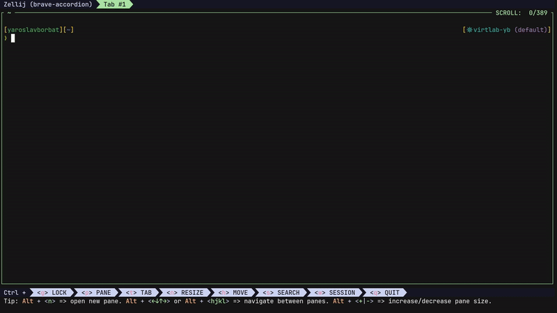

# zellij-bookmarks

A [Zellij](https://zellij.dev) plugin for creating, managing, and quickly inserting command bookmarks into the terminal.



## ✨ Features

- Easily create and manage command bookmarks.
- Quickly filter, view, and insert commands into the terminal.
- Switch between bookmark and label modes for better organization.

---

## 📖 Usage

- **Navigation**: Use `Up` and `Down` to cycle through the bookmarks or labels list.
- **Insert Command**: Press `Enter` to paste the selected bookmark into the terminal.
- **Search**: Start typing to filter the list based on the current mode.
- **Exit**: Press `Esc` or `Ctrl + c` to exit the plugin.
- **Edit Bookmarks**: Press `Ctrl + e` to open the bookmark configuration file for editing.
- **Reload Configuration**: Press `Ctrl + r` to reload bookmarks after making changes.
- **Filter Modes**: Use `Ctrl + f` to toggle filter modes (available only in bookmark mode).
- **Switch Modes**: Press `Ctrl + l` to toggle between Bookmarks and Labels modes.
- **View Commands**: Press `Ctrl + v` to display the command associated with the bookmark (only for bookmarks).
- **Usage Info**: Press `Ctrl + u` to display usage instructions.

---

## 🚀 Installation

### From Source

1. Install Rust and Cargo if you haven't already. Follow the [installation guide here](https://www.rust-lang.org/tools/install).

   Additionally, install the `wasm32-wasip1` target by following the [documentation here](https://doc.rust-lang.org/nightly/rustc/platform-support/wasm32-wasip1.html).
2. Clone the repository:
   ```bash
   git clone https://github.com/yaroslavborbat/zellij-bookmarks.git
   ```
2. Build the plugin:
    ```bash
    task build
    ```
3. Install the plugin:
    ```bash
    task install
    ```
   
### Quick
For a quick installation, run the following command to download the plugin directly:
```bash
mkdir -p ~/.config/zellij/plugins && \
curl -L "https://github.com/yaroslavborbat/zellij-bookmarks/releases/latest/download/zellij-bookmarks.wasm" -o ~/.config/zellij/plugins/zellij-bookmarks.wasm
```
> **Note**: You don't need to keep zellij-bookmarks.wasm at this specified location. It's just where I like to keep my zellij plugins.

---

## ⚙️ Configuration
### Keybinding

Add the following configuration to your [Zellij config](https://zellij.dev/documentation/configuration.html) inside the [keybinds](https://zellij.dev/documentation/keybindings.html) section:

```kdl
shared_except "locked" {
    bind "Alt M" {
        LaunchOrFocusPlugin "file:~/.config/zellij/plugins/zellij-bookmarks.wasm" {
            floating true
            cwd "/home/<USER>/.config/zellij/"
        };
    }
}
```
> **Note**: You likely already have a `shared_except "locked"` section in your configuration. Add the `bind` command there.

> **Note**: Make sure to replace \<USER\> in the cwd path with your actual username.

#### Parameters

- **`exec`**: *(default: `false`)* - If `true`, the command will execute immediately after pressing `Enter`. This can be overridden per bookmark.
- **`ignore_case`**: *(default: `true`)* - When filtering, ignores case sensitivity in both the filter string and bookmark/label names.
- **`cwd`**: *(REQUIRED)* - The absolute path where your bookmarks file will be stored.
- **`filename`**: *(default: `.zellij_bookmarks.yaml`)* - The name of the bookmarks file.

### Bookmarks Configuration

The bookmarks configuration is a YAML file that defines your bookmarks. Each bookmark has the following fields:

- **`name`**: A human-readable name for the bookmark.
- **`command`**: The command to be inserted into the terminal.
- **`exec`**: *(optional)* Whether the command should be executed immediately.
- **`label`**: *(optional)* A category or tag for the bookmark.

#### Example Configuration:
```yaml
bookmarks: 
- name: "Bookmark #1"
  command: "echo 'Your command #1'"
  exec: true
  label: echo
- name: "Bookmark #2"
  command: |
    echo 'Your command #2'
  exec: false
  label: echo
```
---
## 🤝 Contributing

Found an issue or have a feature request? Feel free to [open an issue](https://github.com/yaroslavborbat/zellij-bookmarks/issues/new) on GitHub.