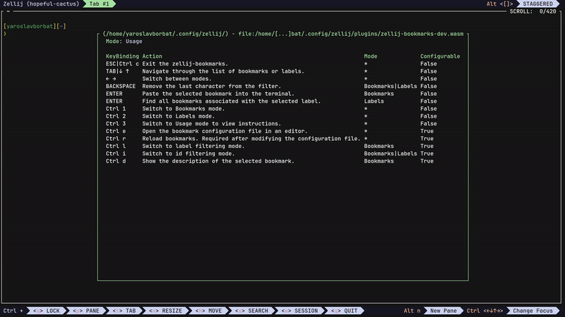

# zellij-bookmarks

A [Zellij](https://zellij.dev) plugin for creating, managing, and quickly inserting command bookmarks into the terminal.



## ✨ Features

- **Easily create and manage command bookmarks**:  
  Create, edit, and organize bookmarks with ease to manage your most common terminal commands.

- **Quickly filter, view, and insert commands into the terminal**:  
  Efficiently search and access commands or bookmarks by name or labels, allowing for fast navigation and command execution.

- **Intuitive Navigation Modes**:  
  Switch between different navigation modes (Bookmarks or Labels) for better organization and streamlined command access.

- **Advanced Templating & Dynamic Command Integration**:  
  Leverage reusable templates and dynamic interpolation with `vars`, `cmd::<command_key>`, and `bookmark::<bookmark_name>`. This allows you to define, customize, and reuse commands efficiently without repetitive configuration.

- **Customizable Hotkeys**:  
  Define and adjust keybindings to better fit your workflow

---

## 📖 Usage

- **Navigation**: Use `Up` and `Down` to navigate through the list of bookmarks or labels.
- **Insert Bookmark**: Press `Enter` to paste the selected bookmark into the terminal.
- **Search**: Start typing to filter the list based on the current mode.
- **Remove Filter Symbol**: Use `Backspace` to delete the last character from the filter input.
- **Switch Modes**: Press `Ctrl Left` or `Ctrl Right` to switch between plugin modes.
- **Exit**: Press `Esc` or `Ctrl c` to exit the plugin.
- **Edit Bookmarks**: Press `Ctrl e` to open the bookmark configuration file in an editor.
- **Reload Bookmarks**: Press `Ctrl r` to reload bookmarks after modifying the configuration file.
- **Switch to Label Filtering Mode**: Press `Ctrl l` to enable label filtering mode. This feature is only available in `Bookmarks` mode.
- **Switch to ID Filtering Mode**: Press `Ctrl i` to enable ID filtering mode. This feature is available in both `Bookmarks` and `Labels` modes.
- **Bookmark Description**: Press `Ctrl d` to display the description of the currently selected bookmark. This feature is only available in `Bookmarks` mode.
- **Switch to Bookmarks Mode**: Press `Ctrl 1` to switch to Bookmarks mode.
- **Switch to Labels Mode**: Press `Ctrl 2` to switch to Labels mode.
- **View Usage Instructions**: Press `Ctrl 3` to switch to Usage mode and view plugin instructions.

---

## 🚀 Installation

For compatibility details, including tested versions, see [COMPATIBILITY.md](COMPATIBILITY.md).

### From Source

1. Install Rust and Cargo if you haven't already. Follow the [installation guide here](https://www.rust-lang.org/tools/install).

   Additionally, install the `wasm32-wasip1` target by following the [documentation here](https://doc.rust-lang.org/nightly/rustc/platform-support/wasm32-wasip1.html).
2. Clone the repository, build, and install the plugin by running the following commands:
   ```bash
   git clone https://github.com/yaroslavborbat/zellij-bookmarks.git
   cd zellij-bookmarks
   task build
   task install
   ```
   
### Quick
For a quick installation, run the following command to download the plugin directly:
```bash
mkdir -p ~/.config/zellij/plugins && \
curl -L "https://github.com/yaroslavborbat/zellij-bookmarks/releases/latest/download/zellij-bookmarks.wasm" -o ~/.config/zellij/plugins/zellij-bookmarks.wasm
```
> **Note**: You don't need to keep zellij-bookmarks.wasm at this specified location. It's just where I like to keep my zellij plugins.

---

## ⚙️ Configuration
### Keybinding

Add the following configuration to your [Zellij config](https://zellij.dev/documentation/configuration.html) inside the [keybinds](https://zellij.dev/documentation/keybindings.html) section:

```kdl
shared_except "locked" {
    bind "Alt B" {
        LaunchOrFocusPlugin "file:~/.config/zellij/plugins/zellij-bookmarks.wasm" {
            floating true
            cwd "/home/<USER>/.config/zellij/"
        };
    }
}
```
> **Note**: You likely already have a `shared_except "locked"` section in your configuration. Add the `bind` command there.

> **Note**: Make sure to replace \<USER\> in the cwd path with your actual username.

> **Important**: The cwd parameter is required. For details on why and what to do if it disappears after a Zellij update, see the [FAQ.md](FAQ.md).

#### Parameters

- **`cwd`**: *(REQUIRED)* - The *ABSOLUTE PATH* where your bookmarks file will be stored.
- **`exec`**: *(default: `false`)* - If `true`, the command will execute immediately after pressing `Enter`. This can be overridden per bookmark.
- **`ignore_case`**: *(default: `true`)* - When filtering, ignores case sensitivity in both the filter string and bookmark/label names.
- **`autodetect_filter_mode`**: *(default: `true`)* - Automatically determines the filtering mode (ID or Name) based on the entered filter string, eliminating the need for manual mode switching.
- **`filename`**: *(default: `.zellij_bookmarks.yaml`)* - The name of the bookmarks file.
- **`bind_edit`**: *(default: `Ctrl e`)* Keybinding to open the bookmark configuration file in an editor.
- **`bind_reload`**: *(default: `Ctrl r`)* Keybinding to reload bookmarks.
- **`bind_switch_filter_label`**: *(default: `Ctrl l`)* Keybinding to switch to label filtering mode.
- **`bind_switch_filter_id`**: *(default: `Ctrl i`)* Keybinding to switch to id filtering mode.
- **`bind_describe`**: *(default: `Ctrl d`)* Keybinding to display the description of the selected bookmark.

### Bookmarks Configuration

The bookmarks configuration is a YAML file that defines your bookmarks. Here's a detailed explanation of the configuration structure and its usage.

### Configuration Structure

#### 1. **`vars`**
A global key-value map for variables. These variables can be used to parameterize commands and bookmarks.

- Use the templating syntax `{{ <variable_name> }}` to reference a variable.
- If you need to include `{{ ... }}` as a literal string in your commands (e.g., for tools like `crictl`), you must escape it with double backslashes (`\\`).

  **Example:**
  ```yaml
  cmds:
  - crictl inspect --output go-template --template '\\{{.info.pid}}' $CTR
  ```

#### 2. **`cmds`**
A map for frequently used commands that aren't directly insertable into the terminal. 
You can include them in bookmarks by referencing them as `cmd::<command_key>`.

#### 3. **`bookmarks`**
A list of bookmarks. Each bookmark has the following fields:

- **`name`**: A unique name for the bookmark. Can be used to link to a bookmark in other bookmarks.
- **`cmds`**: A list of commands for the bookmark. These can include:
   - Plain text commands.
   - Commands referenced from `cmds` using `cmd::<command_key>`.
   - Commands imported from other bookmarks using `bookmark::<bookmark_name>`.
- **`desc`**: *(optional)* A description of the bookmark to provide context or explanation about its purpose.
- **`exec`**: *(optional)* A boolean flag indicating whether the commands should be executed immediately.
- **`labels`**: *(optional)* A list of labels or tags associated with the bookmark.
- **`vars`**: *(optional)* Local variables specific to the bookmark. These have a higher priority than global `vars`.

Commands within a bookmark are concatenated using the separator `&&`.

### Key Concepts

- **Templating with Variables**:  
  Variables defined in `vars` or bookmark-specific `vars` can be used in commands or bookmarks using the syntax `{{ <variable_name> }}`. Bookmark-specific variables take precedence over global ones, allowing flexible and context-specific command customization.

- **Command Reuse with `cmds`**:
   - Use `cmd::<command_key>` to reference predefined reusable commands from `cmds`.
   - Use `bookmark::<bookmark_name>` to include all commands from another bookmark into the current one.
   - Commands are concatenated with `&&`, ensuring sequential execution.

This structure provides a modular, reusable, and powerful way to parameterize commands and configurations using simple templating and bookmark composition.

### Example Configuration

```yaml
vars:
  global_var: "Global value"
  path: "/home/user"

cmds:
  greet: "echo 'Hello, World!'"
  list_files: "ls -la {{ path }}"
  custom_echo: "echo '{{ message }}'"

bookmarks:
- name: "Bookmark1"
  desc: "A test bookmark combining plain text and reusable commands."
  cmds:
  - "echo 'This is Bookmark1'"
  - cmd::greet
  - bookmark::Bookmark2
  - cmd::custom_echo
  exec: false
  labels:
  - "utilities"
  - "example"
  vars:
    message: "Bye Bye!"

- name: "Bookmark2"
  desc: "Command to list files dynamically using the path variable."
  cmds:
  - "cmd::list_files"
  exec: true
  labels:
  - "files"
 ```

### Explanation of the Example

#### **Global Variables**

- **`global_var`** and **`path`** are global variables accessible in all commands and bookmarks.
- The `{{ path }}` variable is used in `cmds` to dynamically include the value of `path`.

#### **Commands (`cmds`)**

- **`greet`**: A reusable command to print a greeting.
- **`list_files`**: A command to list files using the `path` variable.
- **`custom_echo`**: A customizable echo command using the `message` variable.

#### **Bookmarks**

##### **`Bookmark1`**
- Contains:
   - Plain text commands.
   - A reference to the reusable command `cmd::greet`.
   - Imports all commands from **Bookmark2** using `bookmark::Bookmark2`.
- Includes local variables that can customize command behavior.
- Result command that would paste to terminal: 
   ```bash
   echo 'This is Bookmark1' \
   && echo 'Hello, World!' \
   && ls -la /home/user \
   && echo 'Bye Bye!' 
   ```

##### **`Bookmark2`**
- Contains:
   - A command that uses the `list_files` command template (`cmd::list_files`).
- Is executed immediately because `exec: true` is set.
- Result command that would execute:
   ```bash
   ls -la /home/user
   ```
---

## 🧩 More Zellij Plugins by Me

- [`zellij-bookmarks`](https://github.com/yaroslavborbat/zellij-bookmarks) - A Zellij plugin for creating, managing, and quickly inserting command bookmarks into the terminal.
- [`zellij-playbooks`](https://github.com/yaroslavborbat/zellij-playbooks) - A Zellij plugin to browse, select, and execute commands from playbook files directly in the terminal.

---

## 🤝 Contributing

Found an issue or have a feature request? Feel free to [open an issue](https://github.com/yaroslavborbat/zellij-bookmarks/issues/new) on GitHub.